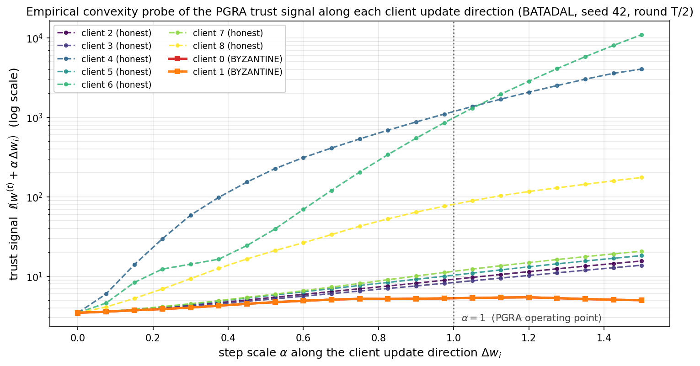

# PGRA — Physics-Guided Robust Aggregation for Federated Anomaly Detection in Water Distribution Networks

This repository contains the reference implementation, experiment harness, and
evaluation artefacts that accompany the manuscript

> **Provably Robust Federated Learning Against Physics-Aware Stealthy
> Poisoning in Water Distribution Networks.**
> M. Homaei, Ó. Mogollón-Gutiérrez, A. Caro, M. Ávila.
> *Under review.*

PGRA is a server-side aggregation rule that augments the conventional
parameter-space view of robust Federated Learning (FL) with a
physics-aware trust signal: for every received client update, the
server forms a tentative global model and re-evaluates it on a curated
set of synthesised H-domain false-data-injection (FDI) signatures.
The per-sample maximum denoising error between the tentative model's
reconstructed pressure field and the verified clean target is used as
a tractable surrogate for the Hazen-Williams residual and feeds an
exponential trust score that drives the aggregation weight of each
client. We prove an exponential-suppression bound on the influence of
malicious updates and verify it empirically on the BATADAL and WADI
benchmarks against a panel of ten contemporary baselines.

## Headline results

| Setting | Aggregator | F1 (↑) | ASR (↓) |
|---|---|---|---|
| **BATADAL** (n_K/N = 2/9) | Centralized Oracle (no attack) | 0.171 ± 0.019 | 0.213 ± 0.006 |
|   | **PGRA (ours)** | **0.181 ± 0.008** | **0.240 ± 0.062** |
|   | Krum               | 0.176 ± 0.011 | 0.257 ± 0.025 |
|   | FLAME              | 0.144 ± 0.023 | 0.317 ± 0.058 |
|   | FLTrust            | 0.023 ± 0.040 | 0.837 ± 0.203 |
| **WADI** (per-sensor, n_K/N = 3/10) | Centralized Oracle (no attack) | 0.219 ± 0.009 | 0.363 ± 0.038 |
|   | **PGRA (ours)** | **0.269 ± 0.025** | **0.430 ± 0.053** |
|   | FedAvg (no defense) | 0.273 ± 0.051 | 0.567 ± 0.006 |
|   | Krum               | 0.220 ± 0.002 | 0.393 ± 0.040 |
|   | FLTrust            | 0.251 ± 0.055 | 0.633 ± 0.145 |

All numbers are mean ± standard deviation across three random seeds.
Full tables and per-seed runs are in the `pgra/results/` directory
produced by `scripts/reproduce.sh`.

## Empirical convexity probe

The local strict-convexity assumption underpinning Theorem 1 of the
manuscript is verified empirically: along each client's update
direction the PGRA trust signal `ℓ(w + α Δw_i)` is unimodal for 9/9
clients with 84.8% of second-divided differences strictly positive.



Solid lines: malicious clients (norm-clipped updates). Dashed lines:
honest clients (raw local updates, viridis colour scale). The
malicious curves are flat-ish because the C1 clipping holds
‖Δw_k‖ small, while honest curves climb steeply along their own
locally-overfit direction.

## Repository layout

```
.
├── README.md                # This file.
├── LICENSE                  # MIT.
├── requirements.txt         # Python dependencies.
├── figures/                 # Figure assets used by the manuscript.
│   └── convexity_probe.png  # Rendered figure (150 dpi).
├── scripts/
│   └── reproduce.sh         # End-to-end reproduction pipeline.
└── pgra/                    # Source.
    ├── config/              # YAML hyperparameter files per dataset.
    ├── data/                # Dataset processors, label sanitisation,
    │                         #   non-IID Dirichlet partitioning.
    ├── models/              # GAE + WDN-to-PyG graph builder.
    ├── physics/             # Hazen-Williams residual and the
    │                         #   denoising surrogate of Eq. (10).
    ├── fl/                  # Federated client / server / aggregators.
    │   ├── client.py        #   FLClient (honest) + MaliciousClient
    │   │                     #     (model-replacement physics-aware
    │   │                     #     attack of Eq. (4)).
    │   ├── server.py        #   FLServer with warm-up denoising.
    │   └── aggregators/     #   pgra, fedavg, krum, coord_median,
    │                         #     fltrust, flame, flair, sine,
    │                         #     fedrola, rfl_apia, centralized_oracle.
    ├── evaluation/          # F1, precision, recall, ASR.
    └── experiments/         # Top-level entry points.
        ├── run_main.py            # Main comparison table.
        ├── run_ablation.py        # α, ε_s, adaptive-vs-static β.
        ├── run_stealthiness.py    # C1 stealthiness inspection.
        ├── run_convexity.py       # Assumption 4.7 probe.
        ├── run_edge_feasibility.py  # Per-client edge-feasibility table.
        ├── analyze.py / finalize.py  # Consolidation utilities.
```

## Installation

```bash
git clone <repository url>
cd <repository name>
python -m venv .venv
source .venv/bin/activate
pip install -r requirements.txt
```

`torch-geometric` may require a matching PyTorch wheel. If the
`pip install` step fails on `torch-geometric`, follow the official
installation matrix at
<https://pytorch-geometric.readthedocs.io/en/latest/install/installation.html>.

## Datasets

We use two public WDN benchmarks. **Neither dataset is redistributed in
this repository.** Place the raw CSVs / EPANET files at the paths
below before running the pre-processing pipeline.

### BATADAL

- Source: <https://www.batadal.net/data.html>
- Files required:
  - `pgra/data/raw/BATADAL_dataset03.csv` (8 761 normal-only training rows)
  - `pgra/data/raw/BATADAL_dataset04.csv` (4 177 labelled test rows)
  - `pgra/data/raw/BATADAL_network.inp` (EPANET topology file)

The processor maps the public-release `ATT_FLAG = −999` sentinel
(unlabelled portion of the original challenge) to the normal class,
yielding the canonical 3 958-normal / 219-attack binary split.

### WADI (A1 release, 9–11 October 2017)

- Source: <https://itrust.sutd.edu.sg/itrust-labs_datasets/> (requires
  iTrust registration).
- Files required:
  - `pgra/data/raw/WADI_14days_new.csv`
  - `pgra/data/raw/WADI_attackdataT.csv`

Per-row labels are derived from the 13 attack windows published in the
iTrust documentation (the same windows used by MAD-GAN, USAD and
TranAD). The processor downsamples by a factor of 60 (one sample per
minute) and uses a 25-node, 25-edge per-sensor directed graph; the
inter-stage chain P1 → P2 → P3 is preserved by adding a single edge
per stage transition.

## Reproducing the experiments

Once the raw CSVs are in place:

```bash
bash scripts/reproduce.sh
```

This processes both datasets, runs the main comparison on each, the
three ablations (α, attacker ε_s, adaptive vs static β), the
stealthiness analysis, the local-convexity probe, and the edge
benchmark; finally it writes a consolidated report into
`pgra/results/final_<timestamp>/REPORT.md`.

Individual stages can also be invoked directly:

```bash
# Main comparison only
python -m pgra.experiments.run_main --dataset batadal --seeds 42 123 456

# A single ablation
python -m pgra.experiments.run_ablation --dataset batadal

# Empirical local-convexity check (produces figures/convexity_probe.png)
python -m pgra.experiments.run_convexity --dataset batadal --seed 42

# Edge-device feasibility table
python -m pgra.experiments.run_edge_feasibility --dataset batadal
```

## Configuration

Per-dataset hyperparameters live in `pgra/config/<dataset>.yaml`. The
defaults reproduce the manuscript numbers. The most important knobs:

| Key | Default | Meaning |
|---|---|---|
| `n_clients`         | 9 / 10  | FL participant count (BATADAL / WADI) |
| `byzantine_ratio`   | 0.222 / 0.3 | Fraction of Byzantine clients |
| `n_rounds`          | 20 / 20 | Communication rounds |
| `local_epochs`      | 2 / 1   | Honest local epochs per round |
| `warmup_epochs`     | 20 / 20 | Server-side denoising warm-up |
| `backdoor_epochs`   | 15 / 30 | Adversary backdoor training length |
| `epsilon_s`         | 4.0 / 10.0 | Attacker C1 stealthiness budget (Eq. 4) |
| `pgra.alpha`        | 20.0    | PGRA sensitivity constant |
| `pgra.gamma`        | 0.005   | PGRA numerical-stability constant |
| `noise_scale`       | 1.8 / 2.5 | Denoising / FDI scale factor `κ` |

## How PGRA works in one paragraph

For every received client update `Δw_i^(t)` the server forms the
tentative global model `w̃_i^(t) = w^(t) + η Δw_i^(t)` and evaluates
the trust signal

```
ℓ_i^(t) = (1/S) Σ_s  max_v  ( H̃_v(w̃_i^(t); H_att^(s)) − H_valid_v^(s) )²
```

on a small server-held set of synthesised (H_att, H_valid, Q_real)
samples. The per-round sensitivity parameter

```
β^(t) = α / ( Var_i log(1 + ℓ_i^(t)) + γ )
```

adapts to the round's spread, and the aggregation weights are
`τ̄_i = softmax_i(−β^(t) ℓ_i)`. Theorem 1 of the manuscript shows that
the malicious cohort's total weight decays as
`O( exp(−β^(t) δ_min) )`, with `δ_min` the gap between the worst
honest and the best malicious `ℓ_i`.

## Edge-device feasibility

The GAE used here has 4 385 trainable scalars (17.1 KB per client
per round). On the BATADAL configuration the per-client per-epoch
median wall time on a commodity CPU is 17 ms; the projected energy
per local round on an NVIDIA Jetson Nano (10 W TDP) is about 1 J
per client. Full per-client and per-edge-platform numbers are produced
by `run_edge_feasibility.py` and tabulated in §6.6.2 of the manuscript.

## Citation

If you use this code or the experimental setup in your research,
please cite:

```bibtex
@article{homaei2026pgra,
  author  = {Homaei, Mohammadhossein and
             Mogoll{\'o}n-Guti{\'e}rrez, {\'O}scar and
             Caro, Andr{\'e}s and
             {\'A}vila, Mar},
  title   = {Provably Robust Federated Learning Against Physics-Aware
             Stealthy Poisoning in Water Distribution Networks},
  journal = {Under review},
  year    = {2026},
}
```

## License

Released under the MIT License — see `LICENSE` for the full text.
